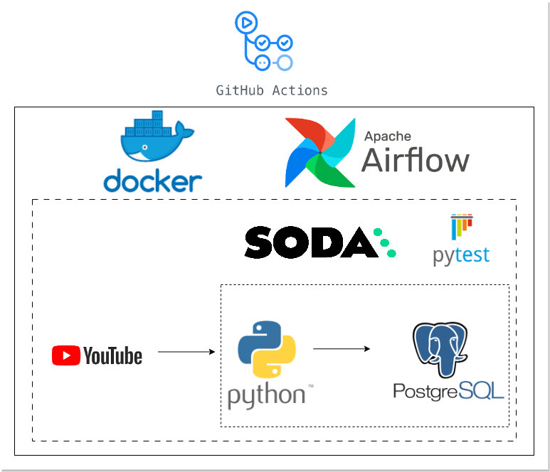

# YouTube ELT Pipeline with Airflow, Docker & PostgreSQL

## **Architecture** 

<p align="center">
  
</p>

## Overview

This project demonstrates an end-to-end ELT (Extract, Load, Transform) pipeline built using Python, Apache Airflow, Docker, and PostgreSQL. The pipeline extracts video analytics data from the YouTube Data API, loads it into a staging layer, transforms the data, and stores it in a curated core layer for analysis.

The project follows data engineering best practices including workflow orchestration, data quality validation, unit testing, containerization, and CI/CD automation.

---

## Dataset

Data is collected from the YouTube Data API using the channel ID of a YouTube creator (e.g., MrBeast). The solution is reusable for any public YouTube channel by simply changing the channel identifier.

### Extracted Fields

- Video ID
- Video Title
- Upload Date
- Duration
- View Count
- Like Count
- Comment Count

---

## Architecture

```text
YouTube API
     │
     ▼
Airflow DAG
     │
     ▼
Staging Schema (PostgreSQL)
     │
Transformation Layer
     │
     ▼
Core Schema (PostgreSQL)
     │
     ▼
Data Quality Checks
```

---

## Technology Stack

| Category | Tools |
|-----------|--------|
| Programming | Python, SQL |
| Orchestration | Apache Airflow |
| Database | PostgreSQL |
| Containerization | Docker, Docker Compose |
| Data Quality | Soda Core |
| Unit Testing | Pytest |
| CI/CD | GitHub Actions |

---

## Airflow Workflows

The pipeline consists of three dependent DAGs:

### 1. produce_json
- Extracts data from the YouTube API
- Generates raw JSON files

### 2. update_db
- Loads raw data into staging tables
- Applies transformations
- Loads curated data into core tables

### 3. data_quality
- Executes data quality validations
- Verifies staging and core layer integrity

---

## Features

- Automated ELT pipeline
- Incremental data loading and upserts
- Dockerized infrastructure
- Airflow-based orchestration
- PostgreSQL staging and core layers
- Data quality checks using Soda Core
- Unit testing with Pytest
- CI/CD automation using GitHub Actions

---

## Running the Project

```bash
docker-compose up -d
```

Access Airflow UI:

```text
http://localhost:8080
```

---

## Testing

Run unit tests:

```bash
pytest
```

Run data quality checks:

```bash
soda scan
```

---

## CI/CD

GitHub Actions automatically:

- Builds Docker images
- Executes tests
- Validates Airflow DAGs
- Deploys updated containers

---

## Learning Outcomes

- Building production-style ELT pipelines
- Airflow DAG orchestration
- Docker containerization
- PostgreSQL data modeling
- Data quality testing
- CI/CD implementation using GitHub Actions